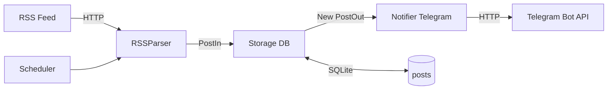

### RSS-to-Telegram Notifier

Приложение парсит RSS-ленту новостного сайта и отправляет уведомления в Telegram о новых постах.

> Примечание: проект реализован с упором на демонстрацию архитектуры backend-приложения.  
> Некоторые компоненты (например, отправка в Telegram или парсинг RSS) могут быть упрощены,  
> чтобы сфокусироваться на структуре и взаимодействии частей системы.

### 1. Схема взаимодействия компонентов

Текстовая схема:
- **RSSParser**: запрашивает RSS-ленту и превращает элементы фида в Pydantic-модель `PostIn` (заголовок, ссылка, дата, хэш контента).
- **Storage**: принимает список `PostIn`, проверяет по БД, какие записи новые (дедупликация по `link + content_hash`), сохраняет только новые и возвращает `PostOut`.
- **Notifier**: получает список `PostOut` и отправляет уведомления в Telegram.
- **Scheduler**: периодически (с заданным интервалом) инициирует процесс обработки: `RSSParser -> Storage -> Notifier`.

Диаграмма (Mermaid):



### 2. Модели данных

На уровне Pydantic и SQLAlchemy модели описаны в `app/models.py`:
- **Pydantic `PostIn`**: `title`, `link`, `published_at`, `content_hash`.
- **Pydantic `PostOut`**: то же самое + опциональный `id`.
- **SQLAlchemy `Post`**: таблица `posts` с полями:
  - `id` (PK),
  - `title`,
  - `link`,
  - `published_at`,
  - `content_hash`,
  - `created_at`,
  - уникальный индекс `uq_posts_link_content_hash` на `(link, content_hash)` для дедупликации.

### 3. Логика дедупликации / кеширования

- **База данных как кеш**: каждый увиденный пост сохраняется в таблицу `posts` с полями `link` и `content_hash`.
- **Алгоритм**:
  - Парсер формирует `PostIn` с уже вычисленным `content_hash` (например, SHA-256 от сочетания заголовка + ссылки + текста).
  - `Storage.save_new_posts()` для каждого `PostIn` выполняет запрос:
    - если запись с теми же `link` и `content_hash` уже есть, пост считается старым и игнорируется;
    - если такой записи нет, создаётся новая строка в БД и пост включается в список новых `PostOut`.
  - Уникальный ключ `(link, content_hash)` на уровне БД гарантирует идемпотентность даже при конкурентном доступе.
- **Почему такой подход**:
  - **Идемпотентность при перезапусках**: при случайном рестарте приложения мы снова пройдёмся по RSS, но уже увиденные посты не будут сохранены повторно и, соответственно, не будут отправлены второй раз.
  - **Надёжнее “last seen timestamp”**: RSS-ленты могут публиковать посты задним числом или менять контент существующих постов. Комбинация `link + content_hash` позволяет отличать как новые посты, так и изменённые версии старых.
  - **Простой кеш**: SQLite в файле — это локальный, прозрачный кеш уже обработанных идентификаторов постов, не зависящий от состояния процесса.

### 4. Структура приложения

- `app/__init__.py` — пакет приложения.
- `app/config.py` — загрузка настроек из `.env` через Pydantic `BaseSettings`.
- `app/models.py` — Pydantic-схемы и SQLAlchemy-модели.
- `app/parser.py` — класс `RSSParser`, парсит RSS (например, с использованием feedparser или стандартных средств) и считает `content_hash`.
- `app/storage.py` — класс `Storage`, работающий с БД и реализующий дедупликацию.
- `app/notifier.py` — класс `Notifier`, отправляющий уведомления через Telegram Bot API (в упрощённой версии может быть заменён на вывод в консоль).
- `app/scheduler.py` — класс `Scheduler`, который связывает парсер, хранилище и нотификатор по расписанию.
- `main.py` — точка входа, запускает цикл планировщика.
- `.env.example` — пример конфигурации.
- `requirements.txt` — зависимости.

### 5. Запуск проекта

1. **Клонировать репозиторий и перейти в папку проекта**:

```bash
git clone <your-repo-url>.git
cd <your-repo-name>
```

2. **Создать и активировать виртуальное окружение (рекомендуется)**:

```bash
python -m venv .venv
source .venv/bin/activate  # для macOS / Linux
# или
.venv\Scripts\activate  # для Windows
```

3. **Установить зависимости**:

```bash
pip install -r requirements.txt
```

4. **Создать `.env` на основе `.env.example`**:

```bash
cp .env.example .env
```

И отредактировать `.env`, указав:
- `RSS_FEED_URL` — URL RSS-ленты.
- `TELEGRAM_BOT_TOKEN` — токен Telegram-бота.
- `TELEGRAM_CHAT_ID` — ID чата/канала для уведомлений.
- `POLL_INTERVAL_SECONDS` — интервал опроса (в секундах).
- `DATABASE_URL` — строка подключения к SQLite (по умолчанию `sqlite:///./rss.db`).

5. **Запустить приложение**:

```bash
python main.py
```

В текущей реализации:
- Приложение стартует, инициализирует настройки, хранилище и шедулер.
- По умолчанию работает циклически: раз в `POLL_INTERVAL_SECONDS` парсер забирает посты из RSS, `Storage` сохраняет только новые, `Notifier` отправляет их в Telegram.
